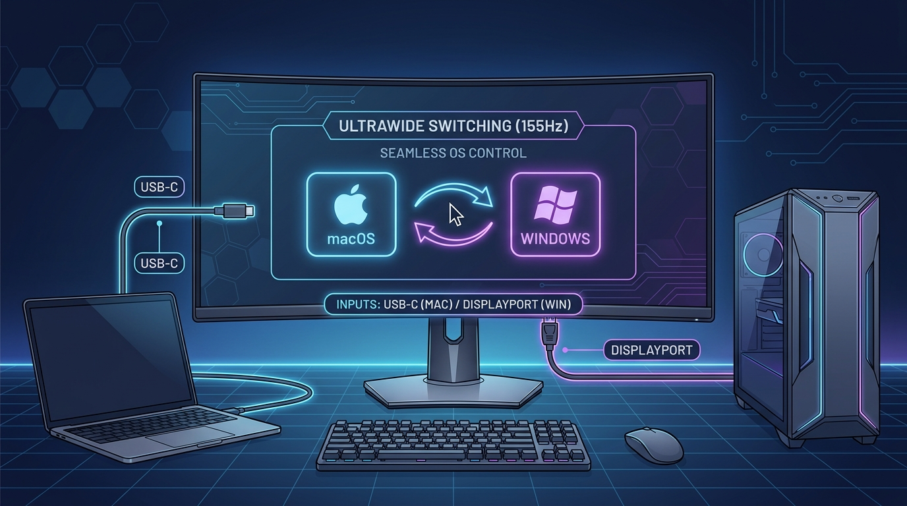
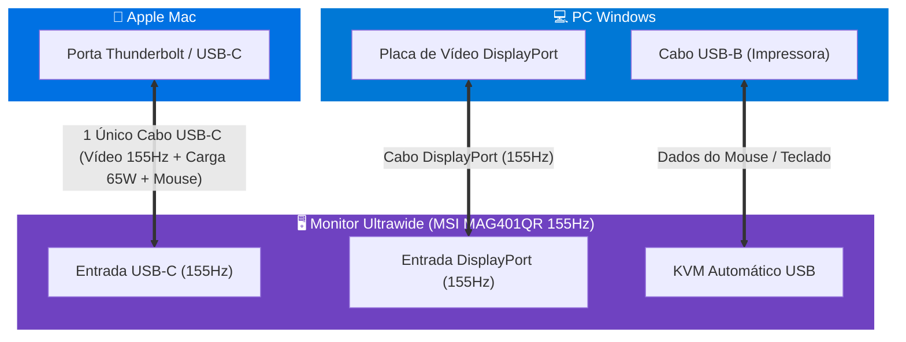

# 🖥️ SCREEN MODE

### O alternador inteligente de monitores Ultrawide entre Mac e Windows a 155Hz

**Alterne instantaneamente entre seu Mac e seu PC Windows com apenas 1 clique ou atalho de teclado global, aproveitando os 155Hz nativos do seu monitor sem precisar de nenhum switch KVM físico!**

[Download macOS (.dmg)](https://github.com/WennyLife/screen-mode/raw/main/release/SCREEN_MODE_macOS.dmg) • [Download Windows (.zip)](https://github.com/WennyLife/screen-mode/raw/main/release/SCREEN_MODE_Windows.zip)

---

## 🌟 Principais Recursos

* ⚡ **Alternância Instantânea em 1 Toque:** Mude entre macOS e Windows via protocolo DDC/CI direto pelo cabo de vídeo.
* ⌨️ **Atalhos Globais de Teclado:**
  * No Mac ➔ **`Cmd + Option + 2`** pula para o Windows.
  * No Windows ➔ **`Ctrl + Alt + 1`** pula para o Mac.
  * *Compatível tanto com a fileira de números de cima quanto com o Teclado Numérico (Numpad)!*
* 🚀 **155Hz Nativos em Ambas as Máquinas:**
  * Mac no cabo **USB-C Thunderbolt** (155Hz + 65W Power Delivery + Mouse/Teclado).
  * Windows no cabo **DisplayPort** (155Hz máximos).
* 🔄 **Sistema de Auto-Update Integrado:** O aplicativo checa automaticamente novidades no GitHub Releases e avisa no topo do menu quando uma nova versão estiver disponível!
* 🛠️ **Zero Hardware Adicional:** Não compre switches KVM caros que limitam a taxa para 60Hz. O controle é 100% digital e sem lag.

---

## 📐 Como Funciona a Conexão

---

## 🍎 Instalação no macOS

1. Baixe o instalador oficial: **[`SCREEN_MODE_macOS.dmg`](release/SCREEN_MODE_macOS.dmg)**.
2. Dê dois cliques no `.dmg` e **arraste o ícone do SCREEN MODE para a pasta Aplicativos**.
3. Abra o **SCREEN MODE** pelo Launchpad ou Spotlight.
4. O ícone 🖥️ aparecerá na sua **Barra de Menus** (perto do relógio).

### Atalhos no Mac:
* **Ir para o Windows:** `Cmd + Option + 2` *(ou pelo menu superior)*.
* **Voltar para o Mac:** `Cmd + Option + 1`.

---

## 🪟 Instalação no Windows

1. Baixe o pacote: **[`SCREEN_MODE_Windows.zip`](release/SCREEN_MODE_Windows.zip)**.
2. Extraia o arquivo `.zip` no seu PC.
3. Dê dois cliques no arquivo **`Instalar_SCREEN_MODE.bat`**.
4. O instalador automático irá:
   * Instalar o SCREEN MODE no seu sistema.
   * Criar os atalhos **🍎 Screen Mac (155Hz)** e **💻 Screen Windows (155Hz)** na sua Área de Trabalho.
   * Ativar o ícone na bandeja do sistema (perto do relógio).
   * Configurar a inicialização automática junto com o Windows.

### Atalhos no Windows:
* **Voltar para o Mac:** `Ctrl + Alt + 1` *(ou dê 2 cliques no atalho da Área de Trabalho)*.
* **Ir para o Windows:** `Ctrl + Alt + 2`.

---

## 🔄 Sistema de Atualização Automática (Auto-Updater)

O **SCREEN MODE** possui integração nativa com o **GitHub Releases**:
* A cada inicialização (e periodicamente em segundo plano), o app verifica se existe uma versão mais recente.
* Se houver nova versão, um banner destacado aparece no topo do menu:
  `✨ Nova Versão Disponível (vX.X)! Clique para Atualizar`
* Você também pode clicar em **`🔄 Verificar Atualizações...`** no menu a qualquer momento.

---

## ⚙️ Configurações Recomendadas no Monitor (MSI MAG401QR)

Para a melhor experiência sem falhas:
1. **Auto Scan:** Deixe em **ON** (Ligado) no menu OSD do monitor. Se uma máquina for desligada, o monitor acha a outra sozinho.
2. **DP OverClocking:** Deixe em **ON** para liberar os **155Hz** no painel.
3. **KVM:** Deixe em **Auto** para o mouse e teclado acompanharem a troca de imagem.

---

## 📄 Licença

Distribuído sob a licença **MIT**. Veja [`LICENSE`](LICENSE) para mais detalhes.
